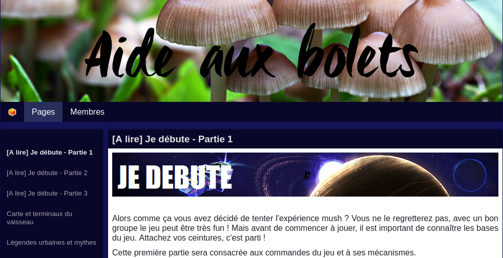

# Archive statique de "l'Aide aux Bolets"

https://cmnemoi.github.io/archive_aide_aux_bolets/

Archive statique de l'Aide aux Bolets, un recueil de tutoriels sur le jeu Mush réalisé par la communauté sur Twinoid.

Ces tutoriels peuvent être utilisés pour jouer à [eMush](https://emush.eternaltwin.org/), une reprise du jeu Mush.

# Licence

Le code source et les images des pages sont la propriété de Motion Twin. 

En vertu de leur annonce du 27 Mars 2020, ces contenus sont mis à disposition sous licence [Creative Commons Attribution - Pas d’Utilisation Commerciale - Partage dans les Mêmes Conditions 4.0 International (CC BY-NC-SA 4.0)](http://creativecommons.org/licenses/by-nc-sa/4.0/).

Le contenu des tutoriels est la propriété de leurs auteurs respectifs.